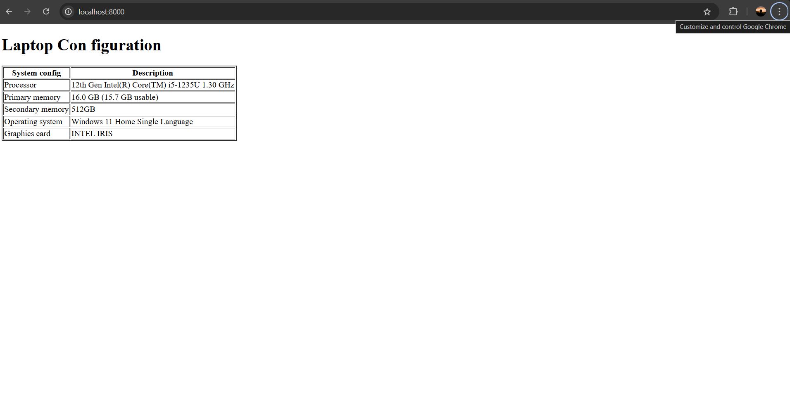

# EX01 Developing a Simple Webserver
## Date:
24-10-2024
## AIM:
To develop a simple webserver to serve html pages and display the configuration details of laptop.

## DESIGN STEPS:
### Step 1: 
HTML content creation.

### Step 2:
Design of webserver workflow.

### Step 3:
Implementation using Python code.

### Step 4:
Serving the HTML pages.

### Step 5:
Testing the webserver.

## PROGRAM:
 ```
from http.server import HTTPServer,BaseHTTPRequestHandler

content='''
<!doctype html>
<html>
<head>
<title> My Web Server</title>
</head>
<body>
<h1>Laptop Con figuration</h1>
<table border="2px">
    <tr>
        <th>System configuration</th>
        <th>Description</th>
    </tr>
    <tr>
        <td>Processor</td>
        <td>12th Gen Intel(R) Core(TM) i5-1235U   1.30 GHz</td>
    </tr>
    <tr>
        <td>Primary memory</td>
        <td>16.0 GB (15.7 GB usable)</td>
    </tr>
    <tr>
        <td>Secondary memory</td>
        <td>512GB</td>
    </tr>
    <tr>
        <td>Operating system</td>
        <td>Windows 11 Home Single Language</td>
    </tr>
    <tr>
        <td>Graphics card</td>
        <td>INTEL IRIS</td>
    </tr>
</table>
</body>
</html>
'''

class MyServer(BaseHTTPRequestHandler):
    def do_GET(self):
        print("Get request received...")
        self.send_response(200) 
        self.send_header("content-type", "text/html")       
        self.end_headers()
        self.wfile.write(content.encode())

print("This is my webserver") 
server_address =('',8000)
httpd = HTTPServer(server_address,MyServer)
httpd.serve_forever()
```
## OUTPUT:



## RESULT:
The program for implementing simple webserver is executed successfully.
